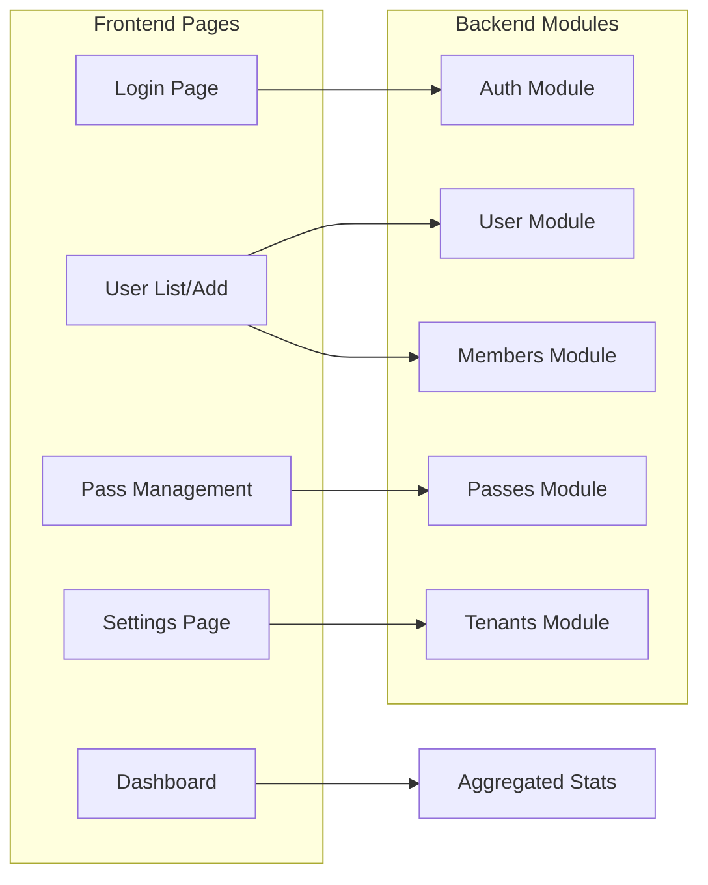

# Project Structure & Dependency Scheme

This document creates a scheme of the `artron` project to visualize connections between components and analyze the impact of changes.

## 1. High-Level Architecture

The project follows a **Monorepo-like structure** hosting both the Frontend and Backend services.

*   **Frontend**: Next.js 14 (App Router)
*   **Backend**: NestJS (located in `server/`)
*   **Shared/Legacy**: `_backup_vite` contains the old frontend, and `types.ts` files appear in multiple locations.

```mermaid
graph TD
    Root[Project Root]
    Root --> Frontend[Frontend (Next.js)]
    Root --> Backend[Backend (NestJS)]
    Root --> Legacy[Legacy (_backup_vite)]
    Root --> Config[Root Configs]

    Frontend --> App[app/ (App Router)]
    Frontend --> Components[components/]
    Frontend --> Public[public/]
    
    Backend --> Src[server/src/]
    Backend --> Db[Database (MongoDB)]
    
    Config --> Pkg[package.json]
    Config --> TS[tsconfig.json]
    Config --> Types[types.ts (Root)]

    subgraph "Data Flow"
        App -- API Calls --> Backend
        App -. Shared Types .-> Types
        Src -. Shared Types .-> Types
    end
```

## 2. Directory Structure & Key Components

### 2.1 Frontend (`/app`)
The Next.js application using the App Router.

*   **(main)**: Main application layout and authenticated routes.
    *   `dashboard/`: Main dashboard view.
    *   `users/`: User management.
    *   `passes/`: Membership/Pass management.
    *   `settings/`: System configuration.
    *   `layout.tsx`: Root layout for authenticated users (sidebar, navbar).
*   **auth**: Authentication related pages (e.g. verify email).
*   **login**: Login page.
*   **onboarding**: Setup wizard/onboarding flow.
*   **super-admin**: Super admin specific control panel.

### 2.2 Backend (`/server/src`)
NestJS application organized by modules.

*   **app.module.ts**: Main application module (Root).
*   **auth/**: Authentication logic (JWT, Strategies).
*   **database/**: Database connection and schema monitoring.
*   **members/**: Member management logic.
*   **passes/**: Pass/Membership logic.
*   **tenants/**: Multi-tenancy support.
*   **user/**: User entity management.

## 3. Component Connections & Dependencies

This diagram shows how specific frontend pages rely on backend modules.



## 4. Impact Analysis: "How Changes Influence Other Parts"

Understanding these connections helps predict side effects.

### 4.1 Shared Types Vulnerability
**CRITICAL**: There are duplicate or defining type definitions in multiple places:
1.  `/types.ts` (Root)
2.  `/app/types.ts` (Frontend specific)
3.  `/server/src/...` (Backend likely has its own DTOs/Schemas)

**Impact**:
*   **Changing `User` interface in `/types.ts`**:
    *   **Directly affects**: Components importing from root `types.ts`.
    *   **Silent Failures**: If `/app/types.ts` defines a similar `User` interface but isn't updated, the frontend views using the local version might break or desync from the backend data structure.
    *   **Recommendation**: Consolidate types into a single "shared" package or strict imports to ensure one source of truth.

### 4.2 Backend Module Changes
*   **Auth Module**:
    *   Changing the Token payload in `AuthModule` will break `middleware.ts` (Next.js middleware) and any frontend `useAuth` contexts that rely on specific claims.
*   **Database Schemas**:
    *   Adding a required field to a Mongoose schema in `server/src/database` *without* updating the frontend validation (Zod/Formik) will cause API errors on submission.

### 4.3 Frontend Component Changes
*   **Global Layout (`app/(main)/layout.tsx`)**:
    *   Changes here affect **ALL** authenticated pages. Adding a heavy provider here impacts the initial load of every dashboard page.
*   **UI Components**:
    *   Modifying a primitive like a "Button" or "Input" in `components/` will ripple across every form in the application (Login, Settings, User Add, etc.). Visual regression testing is needed here.

## 5. Summary of Critical Paths
1.  **Authentication**: `login` -> `AuthModule` -> `UserModule`. Breaking this locks everyone out.
2.  **User Data**: `users` view -> `MembersModule`/`UserModule`. This is the core data loop.
3.  **Type Sync**: `types.ts` <-> Data Models. Desynchronization leads to runtime `undefined` errors.
